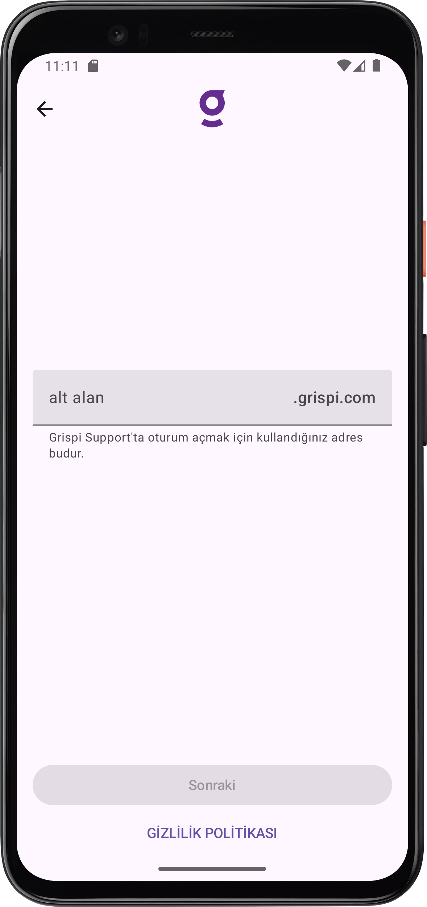
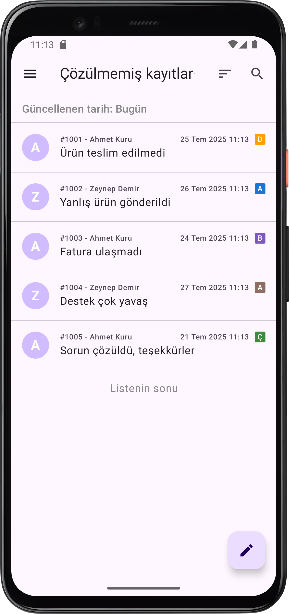
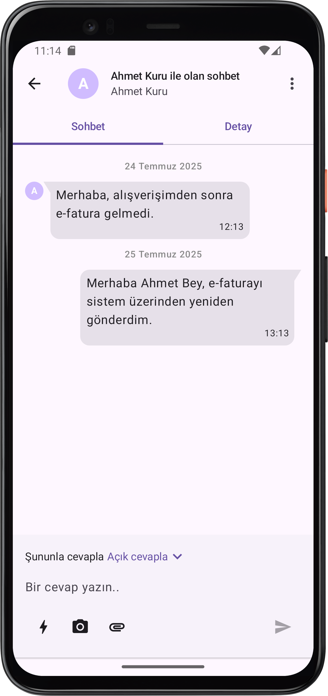
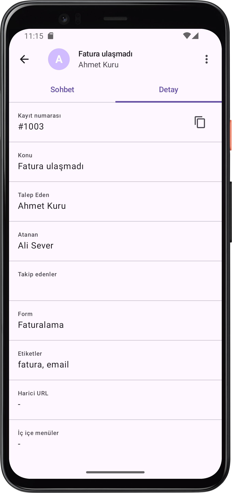

# 🛠️ Grispi Support – Android App

## 📄 Description

This is a **mock mobile support interface** application inspired by the [Zendesk Support Mobile App](https://support.zendesk.com/hc/en-us/articles/4408846407066-About-the-Zendesk-Support-mobile-app).
It has been developed natively using **Kotlin** and **Jetpack Compose**, following modern Android development principles.

The app provides UI screens for a typical support workflow including ticket list, details, and responses. It is designed solely for frontend demonstration purposes using mock data and is built with an emphasis on clean architecture and modularity.

---

## ⚙️ Tech Stack

* **UI**: Jetpack Compose
* **Architecture**: MVI (Model-View-Intent)
* **Dependency Injection**: Hilt
* **Navigation**: Compose Navigation
* **Asynchronous operations**: Kotlin Coroutines
* **ViewModel**: Android Jetpack ViewModel
* **UI Theme**: Material Design 3 (Material You)

---

## 📁 Package Structure

```text
├── di               # Dependency Injection (Hilt)
├── data             # Data layer
├── domain           # Business logic (if needed for future expansion)
└── presentation     # UI layer
    ├── model        # UI models (ViewState, Events, etc.)
    ├── navigation   # Navigation graph & routes
    ├── theme        # MaterialTheme definitions
    ├── util         # Utilities and helpers
    ├── component    # Reusable UI components
    ├── signin       # Sign-in screen
    ├── list         # Ticket list screen
    └── detail       # Ticket detail & response tabs
```

---

## 📱 Screens

* **SignIn** – Basic login screen
* **List** – Shows support ticket list with basic metadata
* **Detail (Detail Tab)** – Displays selected ticket information
* **Detail (Response Tab)** – Shows and allows entering a response

<p align="center">
  
  
  
  
</p>

---

## 🚀 Getting Started

### Prerequisites

* AAndroid Studio Meerkat Feature Drop | 2024.3.2 or later
* Kotlin 2.2.0+
* Gradle 8.11.1+

### Steps

1. Clone the repository:

   ```bash
   git clone https://github.com/yourusername/grispi-support-android.git
   ```
2. Open the project in **Android Studio**.
3. Run the app on an emulator or a real Android device (API 28+ require).

---

## 📌 Notes

* The project uses **mock data only** (no backend).
