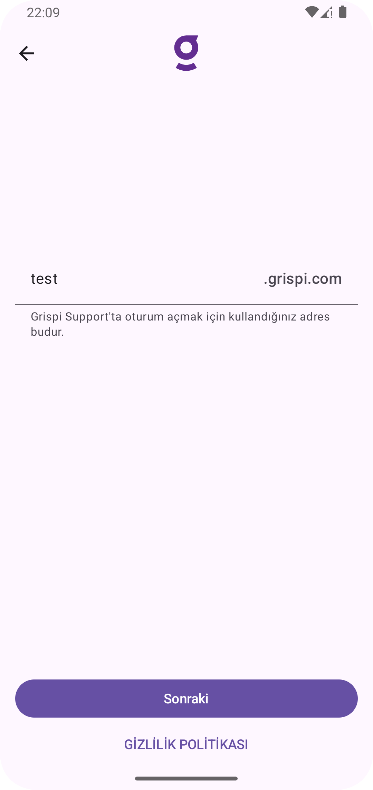
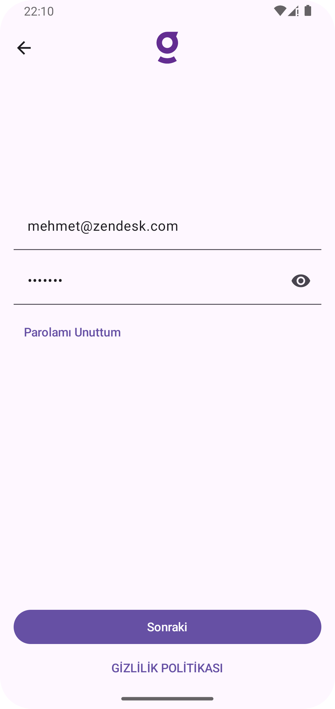
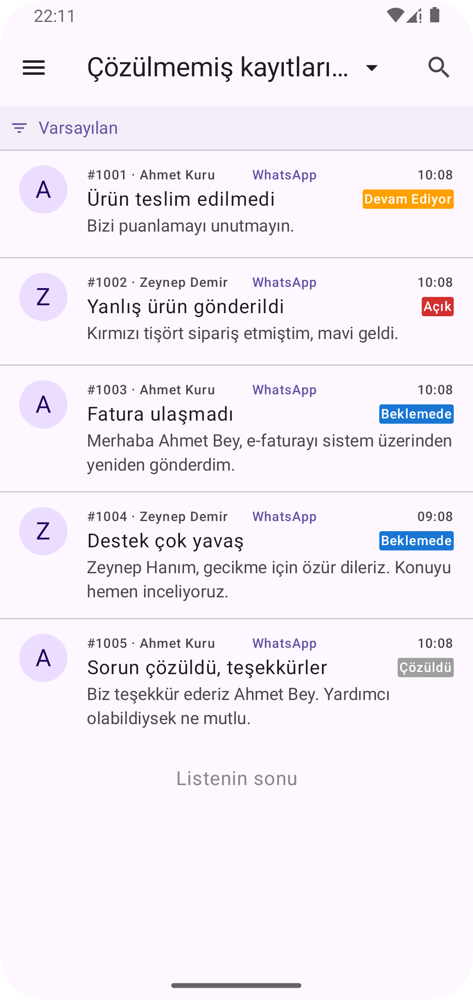
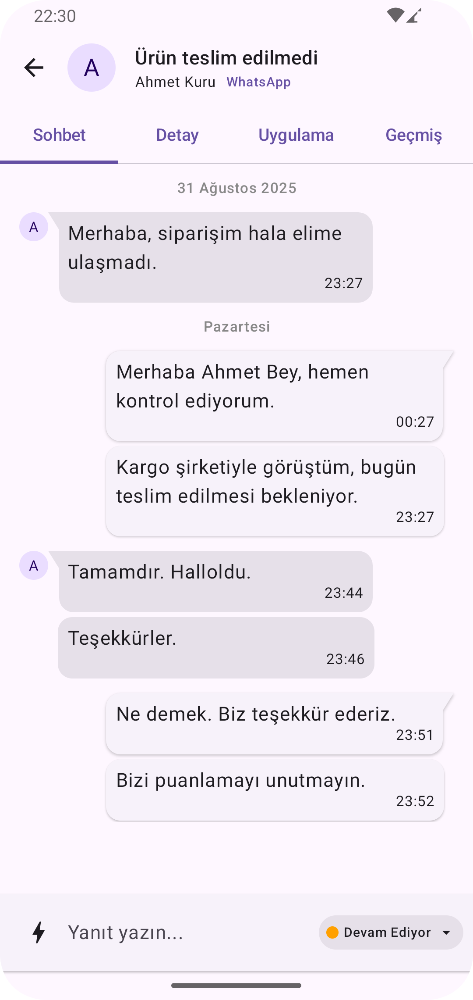
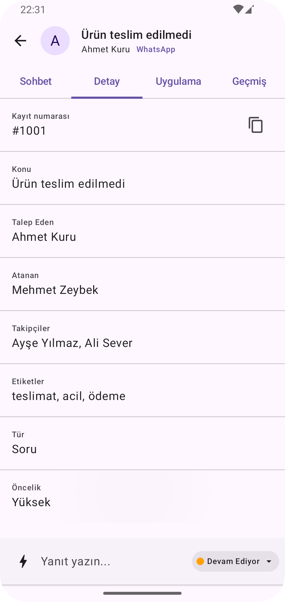
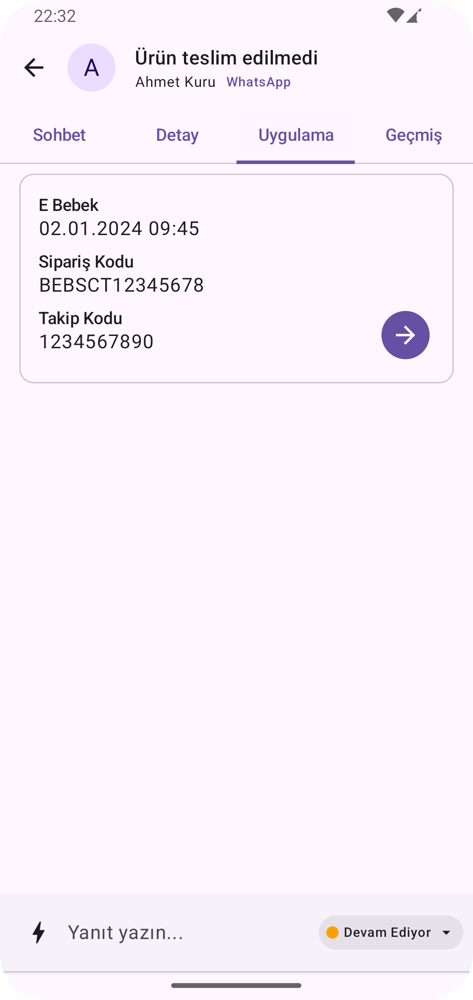
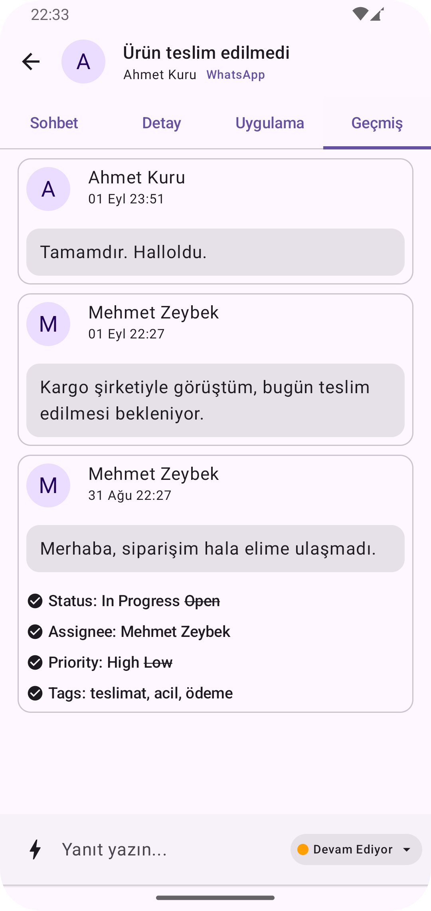
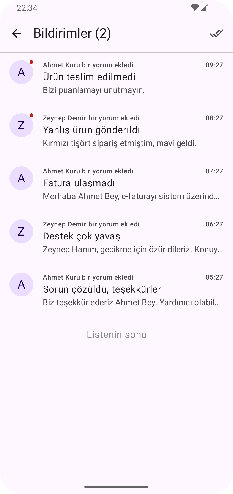
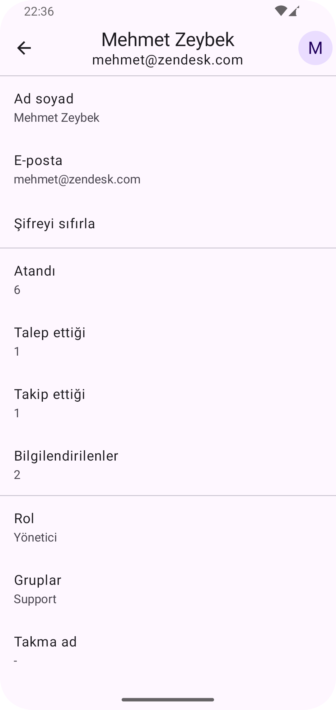
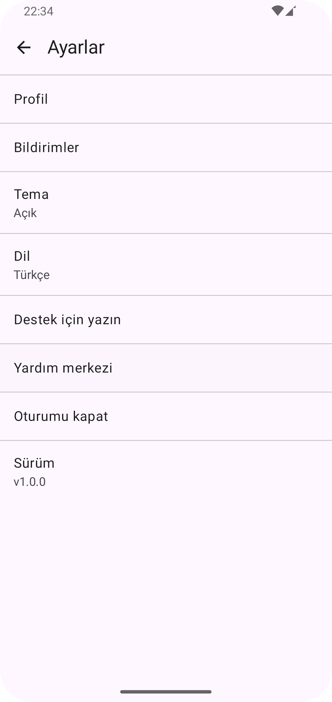

# Grispi Support – Android App

## Description

This is a **mock mobile support interface** application inspired by the [Zendesk Support Mobile App](https://play.google.com/store/apps/details?id=com.zendesk.android).  
It has been developed natively using **Kotlin** and **Jetpack Compose**, following modern Android development principles.

The app provides UI screens for a typical support workflow. It is designed solely for frontend demonstration purposes using mock data, and it follows MVI architectural principles.

---

## Tech Stack

* **UI**: Jetpack Compose  
* **Architecture**: MVI (Model-View-Intent)  
* **Dependency Injection**: Hilt  
* **Navigation**: Compose Navigation  
* **Asynchronous operations**: Kotlin Coroutines  
* **ViewModel**: Android Jetpack ViewModel  
* **UI Theme**: Material Design 3 (Material You)  

---

## Package Structure

```text
├── di                  # Dependency Injection (Hilt)
├── data                # Data layer
├── domain              # Business logic (if needed for future expansion)
└── presentation        # UI layer
    ├── model           # UI models
    ├── navigation      # Components related to navigation
    ├── theme           # MaterialTheme definitions
    ├── util            # Utilities and helpers
    ├── component       # Reusable UI components
    └── screen          # ViewModel, State, Event and Screen Composable related to the relevant screen
        └── component   # Screen-specific components
```

## Screens

* **SignIn** – Basic login screen
* **List** – Shows support ticket list with basic metadata
* **Conversation Tab** – Displays selected ticket information
* **Detail Tab** – Shows and allows entering a response
* **Application Tab** – Displays application details
* **History Tab** – Shows ticket history
* **Profile** – User profile screen
* **Settings** – App settings screen
* **Notification** – Notification center screen

<table>
  <tr>
    <td align="center"></td>
    <td align="center"></td>
    <td align="center"></td>
  </tr>
</table>

<table>
  <tr>
    <td align="center"></td>
    <td align="center"></td>
    <td align="center"></td>
    <td align="center"></td>
  </tr>
</table>

<table>
  <tr>
    <td align="center"></td>
    <td align="center"></td>
    <td align="center"></td>
  </tr>
</table>

---

## Getting Started

### Prerequisites

* Android Studio Meerkat Feature Drop | 2024.3.2 or later
* Kotlin 2.2.0+
* Gradle 8.11.1+

### Steps

1. Clone the repository:

   ```bash
   git clone https://github.com/yourusername/grispi-support-android.git
   ```
2. Open the project in **Android Studio**.
3. Run the app on an emulator or a real Android device (API 28+ require).

---

## Notes

* The project uses **mock data only** (no backend).
